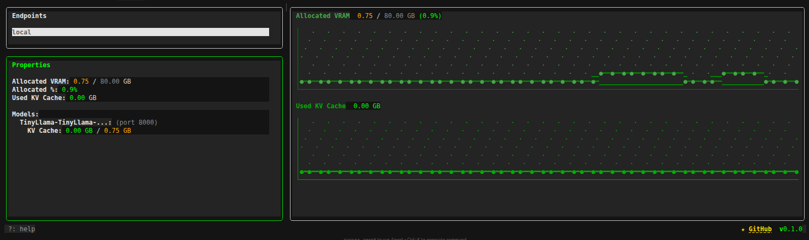

# Blackbox


Blackbox is a monitoring solution for vLLM deployments, consisting of a GPU VRAM monitoring server and a terminal-based CLI client. It provides real-time insights into GPU memory utilization, KV cache blocks, process metrics, and Nsight Compute statistics.


- **blackbox-server**: C++ HTTP server that monitors GPU VRAM using NVML and Nsight Compute
- **blackbox-cli**: Go-based terminal client with interactive dashboard and JSON API

## blackbox-server

GPU VRAM monitoring server with NVML and Nsight Compute integration.

### Installation

**Prerequisites:** Linux (Ubuntu 22+), NVIDIA GPU with drivers 470+, CMake 3.15+, C++17 compiler

```bash
cd blackbox-server
./scripts/install_deps.sh
./scripts/setup.sh
./build/blackbox-server [port]
```

See [blackbox-server/docs/SETUP.md](blackbox-server/docs/SETUP.md) for detailed instructions.

### API Endpoints

**GET /vram** - Returns current VRAM metrics as JSON

```bash
curl http://localhost:6767/vram
```


See [blackbox-server/docs/API.md](blackbox-server/docs/API.md) for complete API documentation.

## blackbox-cli

Terminal-based monitoring client with interactive dashboard and JSON output.

### Installation

```bash
cd blackbox-cli
go build -o blackbox ./main.go
sudo mv blackbox /usr/local/bin/  # Optional: install globally
```

### Usage

**Interactive Dashboard (Default):**
```bash
blackbox
```



This launches an interactive TUI dashboard showing:
- VRAM usage metrics
- Memory blocks (allocated/utilized)
- Processes using GPU memory
- Blocks grouped by model (shows which blocks belong to which deployed model)
- Real-time charts and statistics

**Keyboard Shortcuts (in dashboard):**
- `Tab` - Switch between panels (Endpoints, Metrics, Data)
- `j/k` - Navigate/scroll in focused panel
- `n` - Create new endpoint
- `e` - Edit selected endpoint
- `d` - Delete selected endpoint
- `r` - Refresh data
- `?` - Show help
- `q` or `Ctrl+C` - Quit

**Command-Line Options:**
```bash
blackbox [flags]
```

Flags:
- `--url <url>`: Server URL (default: `http://127.0.0.1:8080`)
- `--endpoint <path>`: API endpoint (default: `/vram`)
- `--timeout <duration>`: HTTP timeout (default: `10s`, e.g. `10s`, `500ms`)
- `--interval <duration>`: Polling interval for dashboard (default: `3s`)

**Examples:**
```bash
# Connect to remote server
blackbox --url http://192.168.1.100:6767

# Faster polling (1 second intervals)
blackbox --url http://localhost:6767 --interval 1s

# Get single JSON snapshot
blackbox stat --url http://localhost:6767

# Watch snapshots continuously (compact JSON)
blackbox stat --watch --interval 5s --compact --url http://localhost:6767
```

**JSON Output (`stat` command):**
```bash
# Single snapshot (pretty-printed)
blackbox stat

# Single snapshot (compact)
blackbox stat --compact

# Watch mode (continuous updates)
blackbox stat --watch --interval 3s
```

The JSON output includes:
- `blocks[]` - Each block now has `model_id` and `port` fields to identify which model it belongs to
- `total_bytes`, `used_bytes`, `free_bytes` - Overall GPU memory
- `allocated_blocks`, `utilized_blocks`, `free_blocks` - Block statistics
- `processes[]` - GPU processes with memory usage
- `nsight_metrics{}` - Nsight Compute metrics per PID

### Configuration


Configuration file: `~/.config/blackbox/config.json`

```json
{
  "endpoints": [
    {
      "name": "local",
      "base_url": "http://127.0.0.1:6767",
      "endpoint": "/vram",
      "timeout": "2s"
    },
    {
      "name": "remote",
      "base_url": "http://192.168.1.100:6767",
      "endpoint": "/vram",
      "timeout": "5s"
    }
  ]
}
```

**Note:** The default server port is `6767`, not `8080`. Update the `--url` flag or config file accordingly.


## API Endpoints

**Monitoring:**
- `GET /vram` - Current VRAM metrics (memory, blocks, processes, Nsight metrics)
- `GET /vram/stream` - Real-time SSE stream

**Model Management:**
- `POST /deploy` - Deploy HuggingFace models with vLLM Docker


- `POST /spindown` - Stop and remove deployed models
- `GET /models` - List all deployed models with VRAM usage stats
- `POST /optimize` - Optimize GPU utilization by restarting overallocated models

**Data Sources:** NVML (GPU memory), vLLM Metrics API (KV cache), Nsight Compute (GPU activity)

See [blackbox-server/docs/API.md](blackbox-server/docs/API.md) for complete API documentation.

## Project Structure

```
blackbox/
├── blackbox-server/          # C++ HTTP server
│   ├── src/
│   │   ├── infra/            # HTTP server, main entry
│   │   ├── services/         # Business logic (NVML, vLLM, deployment)
│   │   ├── utils/            # Utilities (JSON, env)
│   │   └── configs/          # vLLM configs (T4, A100, H100, L40)
│   ├── include/              # Headers (mirrors src structure)
│   └── docs/                 # Documentation
│
└── blackbox-cli/             # Go CLI client
    ├── cmd/                  # Cobra commands
    └── internal/             # Client, config, UI components
```

## Further Documentation

- [Server API Reference](blackbox-server/docs/API.md) - Complete API documentation
- [Server Setup Guide](blackbox-server/docs/SETUP.md) - Detailed installation instructions
- [Server Implementation](blackbox-server/docs/IMPLEMENTATION.md) - Technical details
